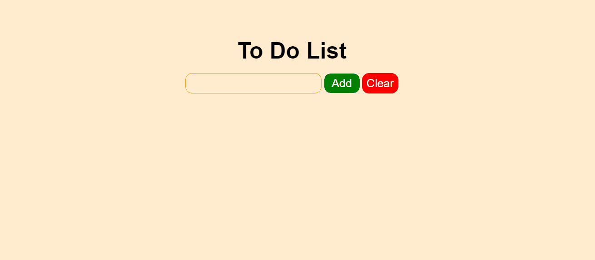

<h1>Simple JavaScript Exercises</h1>

<h2>Making a check list</h2>

<ul>
    <li>Adding titles</li>
    <li>Override the text with one click (work done)</li>
    <li>Delete the text with double click</li>
    <li>Clear all list</li>
</ul>

HTML, CSS and JavaScript

<h1>Screen View</h1>

